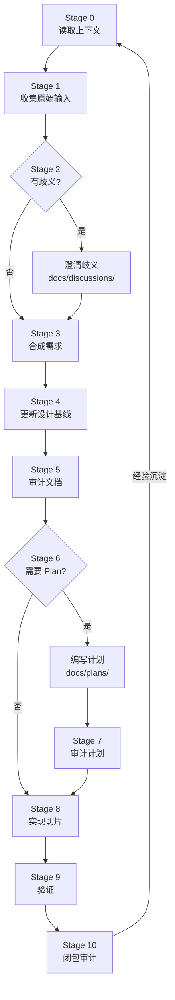

# 开发工作流程

## 工作模式

采用 **AGE 11 阶段工作流（Stage 0-10）**，以吸引子（稳定文档）为中心收敛。每个阶段都有明确的输入、输出和质量门禁。

```
Stage 0  读取上下文
Stage 1  收集原始输入
Stage 2  澄清歧义（可选）
Stage 3  合成需求
Stage 4  更新设计基线
Stage 5  审计文档
Stage 6  编写计划（按需触发）
Stage 7  审计计划
Stage 8  实现切片
Stage 9  验证
Stage 10 闭包审计
```

### 三步核心控制循环

整个工作流围绕三步控制循环展开：

- **A. 生成设计文档**（Stage 3-4）— 需求设计 vs 架构设计分开写，互相引用，独立审查
- **B. 根据设计文档生成 Plan**（Stage 6）— 从稳定基线出发，独立审查
- **C. 定期审计**（Stage 5 + Stage 7 + Stage 10）— 文档审计 + 计划审计 + 闭包审计

---

## Stage 0：读取上下文

**目标**：让 AI 进入项目，理解约定和现状。

**输入**：无（首次进入）

**动作**：
- 读取 `docs/context/` — 项目背景、代码约定、真相源优先级、AI 自主性边界
- 读取 `docs/architecture/` — 技术架构、技术栈、系统基线
- 读取 `AGENTS.md` — AI 行为契约

**输出**：AI 已建立项目心智模型

**门禁**：✅ 能说出项目做什么、用什么技术栈、验证命令是什么

---

## Stage 1：收集原始输入

**目标**：把用户的原始需求、想法、问题落地到仓库。

**动作**：
- 将对话中的原始需求写入 `docs/input/`（带日期前缀，如 `2026-08-03-feature-req.md`）
- 记录所有相关的链接、截图、参考资料

**输出**：`docs/input/YYYY-MM-DD-*.md`

**门禁**：✅ 原始输入已落地到文件，不只留在聊天里

---

## Stage 2：澄清歧义（可选）

**目标**：在合成需求前，消除输入中的歧义。

**触发条件**：需求中存在模糊、矛盾或缺失的关键信息时。

**动作**：
- 在 `docs/discussions/` 记录歧义点和澄清结果
- 向用户提出简短的澄清问题

**输出**：`docs/discussions/YYYY-MM-DD-*.md`（可选）

**门禁**：✅ 关键歧义已解决或有明确记录

---

## Stage 3：合成需求

**目标**：将原始输入收敛为实现就绪的需求文档。

**动作**：
- 将澄清后的输入合成为结构化需求，写入 `docs/requirements/`
- 明确验收标准（必须可测试）
- 明确范围边界（In Scope / Out of Scope）

**输出**：`docs/requirements/*.md`

**门禁**：✅ 需求有明确的验收标准，且验收标准可测试

---

## Stage 4：更新设计基线

**目标**：根据需求更新设计文档（业务设计和技术架构分开写）。

**动作**：
- 业务/需求设计 → 更新 `docs/design/`
- 技术架构设计 → 更新 `docs/architecture/`
- 两者交叉引用，不混为一个文档
- 重大决策记录为 ADR（`templates/adr.template.md`）

**输出**：更新的 `docs/design/` 和 `docs/architecture/`

**门禁**：✅ 设计文档与需求一致，设计分离原则已遵循

---

## Stage 5：审计文档

**目标**：独立审查设计文档的质量和一致性。

**动作**：
- 使用独立子 Agent 审查（不自己审查自己）
- 审查者必须引用文件和证据
- 检查：需求与设计是否一致、架构约束是否被遵守、文档是否与代码现状冲突
- 审计报告写入 `docs/audits/`

**输出**：`docs/audits/YYYY-MM-DD-doc-audit.md`

**门禁**：✅ 独立审查通过，主要异议已解决

### ⚠️ 重要

**审计必须由独立的审查者（人类或另一个 Agent）执行**。实现者不能审计自己的产出。

---

## Stage 6：编写计划（按需触发）

**目标**：为复杂变更编写执行计划。

### 必须写 Plan 的触发条件

- 变更 API、数据库/模型、认证、集成、部署
- 跨多个功能面变更用户可见行为
- 涉及多个模块、改变共享行为
- 预计超过一个 AI Session
- 需要分阶段执行或显式闭包门
- 存在未解决的产品/技术风险

### 可以跳过 Plan 的场景

- 文案修改、小型样式调整
- 纯测试代码清理
- 单文件修复且有明确测试覆盖
- 低风险本地编辑

**动作**：
- 基于稳定设计基线编写 Plan
- Plan 写入 `docs/plans/`
- 使用 `templates/plan.template.md` 模板

**输出**：`docs/plans/YYYY-MM-DD-*.md`（按需）

**门禁**：✅ Plan 从稳定基线出发，分阶段清晰

---

## Stage 7：审计计划

**目标**：独立审查计划的可行性和完整性。

**动作**：
- 使用独立子 Agent 审查 Plan
- 检查：计划是否覆盖所有需求点、阶段划分是否合理、闭包门是否明确
- 审计报告写入 `docs/audits/`

**输出**：`docs/audits/YYYY-MM-DD-plan-audit.md`

**门禁**：✅ 独立审查通过，计划可行

---

## Stage 8：实现切片

**目标**：按计划实现最小完整切片。

**动作**：
- 遵循 TDD：红 → 绿 → 重构
- 一个真实功能切片 > 五个空壳页面
- 优先现有项目模式 > 发明新抽象
- 遵循 `docs/context/conventions.md` 编码规范
- 遵循 `docs/standards/` 下所有规范

**输出**：源代码 + 单元测试

**门禁**：✅ 测试全部通过

---

## Stage 9：验证

**目标**：确认实现正确且符合预期。

**动作**：
- 运行完整测试套件（验证命令必须真实可执行）
- 手动验证核心功能
- 检查代码与设计文档一致
- 检查性能、安全是否达标
- 测试规范参见 `docs/standards/testing.md`

**输出**：测试报告 + 验证记录

**门禁**：✅ 所有测试通过，验收标准满足

---

## Stage 10：闭包审计

**目标**：独立验证任务是否真正完成，防止过早宣布胜利。

**动作**：
- 使用独立子 Agent 审查
- 按 [驾驭工程五维模型](../standards/harness.md) 检查：

| 维度 | 审计问题 |
|------|---------|
| **Task Understanding** | Agent 是否理解目标和"完成"定义？ |
| **Controlled Execution** | 工作是否在可重复路径上？ |
| **Change Validation** | 是否有证据证明变更有效？ |
| **Reliable Delivery** | AI 速度是否绕过了质量检查？ |
| **Learning Capture** | 下一个任务是否受益于本次？ |

### 检查清单

- [ ] 测试覆盖了本次修改后的代码（非旧版本）
- [ ] 验收标准全部满足
- [ ] 代码审查已通过（使用 `docs/audits/code-review.template.md`）
- [ ] 无未解决的警告或错误
- [ ] 文档与实现一致
- [ ] CHANGELOG 已更新
- [ ] 经验已沉淀（参见 Loop Discovery 决策树）

### 经验沉淀决策树

```
发现可复用的经验
  ├─ 稳定事实 → 写回 AGENTS.md 或核心文档
  ├─ 重复方法 → 整理成 Skill
  ├─ 确定性操作 → 交给 CLI、脚本、Hook 或 CI
  ├─ 需要外部资源发现 → 使用 MCP
  └─ 高风险不可逆操作 → 保留权限边界和人工确认
```

**输出**：`docs/audits/YYYY-MM-DD-closure-audit.md` + 任务状态更新

**门禁**：✅ 独立审查通过，任务真正完成

### ⚠️ 重要

**闭包审计必须由独立的审查者执行**。实现者不能审计自己的代码。

---

## 完整流程图



---

## 质量门禁汇总

| 阶段 | 门禁 |
|------|------|
| Stage 0 读取上下文 | ✅ 能说出项目做什么、技术栈、验证命令 |
| Stage 1 收集输入 | ✅ 原始输入已落地到文件 |
| Stage 2 澄清歧义 | ✅ 关键歧义已解决 |
| Stage 3 合成需求 | ✅ 验收标准明确且可测试 |
| Stage 4 更新设计 | ✅ 设计与需求一致，设计分离 |
| Stage 5 审计文档 | ✅ 独立审查通过 |
| Stage 6 编写计划 | ✅ Plan 从稳定基线出发 |
| Stage 7 审计计划 | ✅ 独立审查通过 |
| Stage 8 实现切片 | ✅ 测试全部通过 |
| Stage 9 验证 | ✅ 验收标准满足 |
| Stage 10 闭包审计 | ✅ 独立审查通过，经验已沉淀 |

---

## 相关文档

- [AGENTS.md](../../AGENTS.md) — AI 行为契约（工作流权威定义）
- [驾驭工程实践](../standards/harness.md) — 五步渐进式构建
- [代码审查 Skill](../skills/code-review.md) — 双轴审查模型
- [TDD Skill](../skills/tdd.md) — 测试驱动开发
- [审查报告模板](../audits/code-review.template.md) — 代码审查报告格式